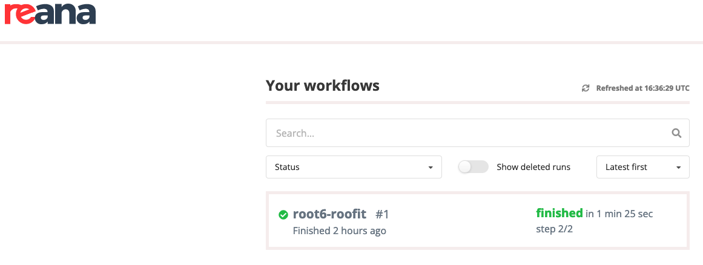

# Manual Setup

After the cluster is provisioned through the [GRyCAP IM](https://appsgrycap.i3m.upv.es:31443/im-dashboard/login), logon `ssh -i <keyfile.pem> <username>@<ip>` to the the master VM using the cloud credentials accessible from the IM Dashboard (see [documentation(https://imdocs.readthedocs.io/en/latest/dashboard.html#infrastructures)).

Check the volume is attached, the NFS server is running and publishing the attached volume:

```bash
df -h
systemctl | grep nfs
showmount --exports # to check from another device run: showmount -e <ip>
```

Switch to the K8s cluster and create a *StorageClass* for the REANA Helm chart to use (this might require to install an [external NFS provisioner](https://github.com/kubernetes-sigs/nfs-subdir-external-provisioner)):

```yml
apiVersion: storage.k8s.io/v1
kind: StorageClass
metadata:
  name: <helm-release-name>-shared-volume-storage-class.yml
parameters:
  archiveOnDelete: "false"
provisioner: fuseim.pri/ifs
```
[SC YAML Template](reana_cnaf/reana-cnaf-demo/manual-setup/helm-release-name-shared-volume-storage-class.yml)

After that you can install the official REANA Helm Chart as follows:

```bash
helm install --devel <helm-release-name> reanahub/reana --wait -n reana --set shared_storage.backend=nfs --set traefik.ports.websecure.nodePort=30444
```
**Note:** *Set storage backend to NFS and you might need to change the port as it is beeing used by K8s Dashboard.*

Once the service is up and running run the commands shown in the Helm install output to finish the REANA setup and test it.

The ingrees might not be working correctly with traefik. In that case replace it with an nginx one:

```yml
apiVersion: networking.k8s.io/v1
kind: Ingress
metadata:
  annotations:
    ingress.kubernetes.io/ssl-redirect: "true"
    kubernetes.io/ingress.class: nginx
    meta.helm.sh/release-name: reana-v2
    meta.helm.sh/release-namespace: reana
    traefik.frontend.entryPoints: http,https
  name: <helm-release-name>-ingress
  namespace: reana
spec:
  rules:
  - http:
      paths:
      - backend:
          service:
            name: <helm-release-name>-server
            port:
              number: 80
        path: /api
        pathType: Prefix
      - backend:
          service:
            name: <helm-release-name>-server
            port:
              number: 80
        path: /oauth
        pathType: Prefix
      - backend:
          service:
            name: <helm-release-name>-ui
            port:
              number: 80
        path: /
        pathType: Prefix
  tls:
  - secretName: <helm-release-name>-tls-secret
status:
  loadBalancer:
    ingress:
    - ip: <lb-ip>
```
[ING YAML Template](reana_cnaf/reana-cnaf-demo/manual-setup/helm-release-name-ingress.yml)

To verify everything is now working correctly access the UI and see if the demo workflow was running correctly:



and check the pysical NFS volume on the VM, there you should now see a new folder called `reana<helm-release-name>-shared-persistent-volume-pvc-<generated-suffix>`:


